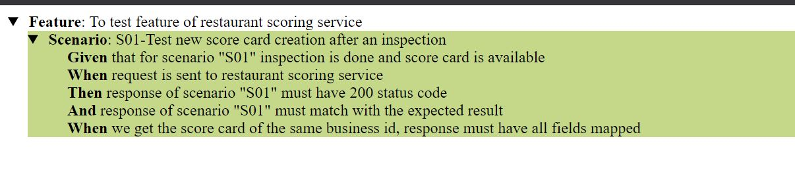

== Test suite
This application tests the scenarios of restaurant-scoring-service and validates if the functionalities of the service
are working as expected

It uses https://cucumber.io/[Cucumber] - a Behaviour driven development framework to test the features. Behaviours are
recorded in https://cucumber.io/docs/gherkin/[Gherkin] format in feature files. Each Gherkin scenario consists of multiple steps
written in plain English and can be easily understood by anyone. Implementations of these
Gherkin steps are written in Java methods.

For testing restaurant-scoring-service, we need to test all the endpoints by passing
request body and authorization header. To make Rest calls, https://rest-assured.io/[RestAssured] library is used

Junit Assertions are used for validating the actual response with the expected result which are stored under src/main/resources/iofiles

=== Execution Steps
- Execute `mvn test` for running the tests
- CucumberTestRunner class will be triggered. Features files are supplied as CucumberOptions in this class
- All feature files available in the path will be executed sequentially
- This application is configured to produce HTML and XML reports
- Check in target/cucumber/index.html and target/cucumber-reports/cucumber.xml for reports

=== Reports
==== HTML Report

==== XML Report
[source,xml]
<?xml version="1.0" encoding="UTF-8" standalone="no"?>
<testsuite errors="0" failures="0" name="io.cucumber.core.plugin.JUnitFormatter" skipped="0" tests="1" time="4.263">
<testcase classname="To test feature of restaurant scoring service" name="S01-Test new score card creation after an inspection" time="1.439">
<system-out>
<![CDATA[Given that for scenario "S01" inspection is done and score card is available.passed
When request is sent to restaurant scoring service..........................passed
Then response of scenario "S01" must have 200 status code...................passed
And response of scenario "S01" must match with the expected result..........passed
When we get the score card of the same business id, response must have all fields mapped.passed
]]>
</system-out>
</testcase>
</testsuite>

=== What's Left out
I implemented template application that takes advantages of behaviour driven testing for testing REST api
using Cucumber & Rest Assured. Only one scenario is added due to lack of time.

Extending this test suite to cover all possible business scenarios acts as best source for regression testing

