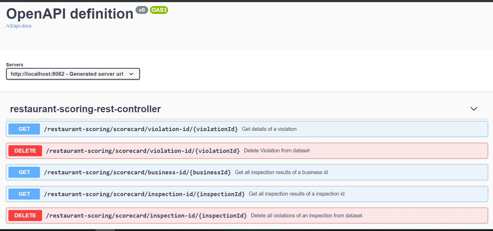
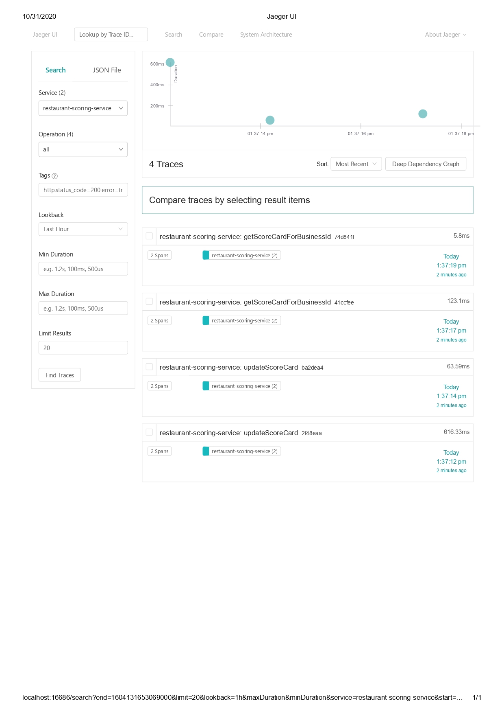
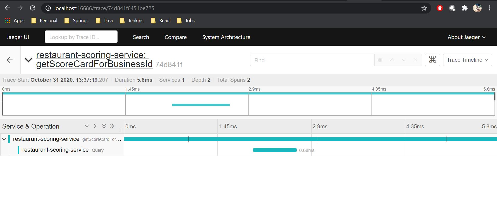

= Restaurant Scoring Service

This is a backend service which provides CRUD APIs for restaurant scoring

== How to launch the service
=== Pre-requisites
==== Mandatory
- Java 11, Maven
- PostgreSQL

==== Optional
- Jaeger. If Jaeger is setup, change `opentracing.jaeger.enabled` to `true` for enabling traces

Once pre-requisites are in place, use the IDE of your choice and run the service using `mvn spring-boot:run`

== Endpoints

After application is launched, hit the url - http://localhost:8082/swagger-ui.html. A window pops up requesting for credentials.
Use "public" as username and password. You should see Open Api definition like below

Role based authentication is described in <<Security,security>> section

== Database Schema

Following tables are used.

==== restaurant_status

This table holds the inspection status and the last inspection date of each business id

===== Schema
`+create table inspection.restaurant_status (
business_id varchar(255) not null,
inspection_date timestamp with time zone,
status varchar(255),
PRIMARY KEY (business_id)
);+`

==== restaurant_data
This is created as per LIVES version 2.0. Primary key is combination of *business_id, inspection_id and violation_id*

===== Schema
`+create table inspection.restaurant_data (
        business_id varchar(255) not null,
        business_name varchar(255),
		business_address varchar(255),
        business_city varchar(255),
        business_state varchar(255),
		business_postal_code varchar(255),
		business_latitude varchar(255),
        business_longitude varchar(255),
        business_location point,
        business_phone_number varchar(255),
        inspection_id varchar(255),
		inspection_date timestamp with time zone,
		inspection_score decimal,
		inspection_type varchar(255),
		violation_id varchar(255),
		violation_description varchar(255),
		risk_category varchar(255),
        CONSTRAINT PK_business PRIMARY KEY (business_id,inspection_id,violation_id)
        /* Uncomment below two lines if data setup is done in restaurant_status table. For casual testing of the application, I commented foreign key relationship */
        /*,*/
		/*CONSTRAINT fk_business FOREIGN KEY(business_id) REFERENCES inspection.restaurant_status(business_id)*/
);+`

== Security

Following users are added to InMemoryUserDetailsManager

- Inspector: Has authorities to `scope:read` and `scope:write`. Username and password is *inspector*
- Public: Has authorities to `scope:read` only. Username and password is *public*

Reason for creating above roles is to restrict the use of POST, PUT and DELETE methods to only inspectors

In Postman, under Authorization, choose `Basic Auth`. Type username and password depending on the endpoint you want to test.
`inspector` credentials works for all URLs whereas `public` endpoint works only for `GET` URLs

Key thing to remember is to pass the correct Authorization header. If you are facing any issues or if the explanation is
not clear, simply add `Authorization` as key and `Basic aW5zcGVjdG9yOmluc3BlY3Rvcg==` as value. That should work

== Monitoring

Spring boot actuator is added to classpath which will enable `/health` endpoint to check the health of the application

After application is started, hit `http:localhost:8082/actuator/health` to monitor health

== Tracing & Observability

Open tracing Jaeger is integrated into this service. Check snippets below

==== Jaeger home screen displaying service details

==== Details of one Trace

== Test Data

Ensure Authorization header is added before testing. For sample request, refer cucumber-testsuite application.
Navigate to `src/test/resources/iofiles/feature/F1/S01/request.json`

This request can be used for `POST` and `PUT` methods. For `GET` methods, make sure the correct URL is chosen and parameter
is passed

